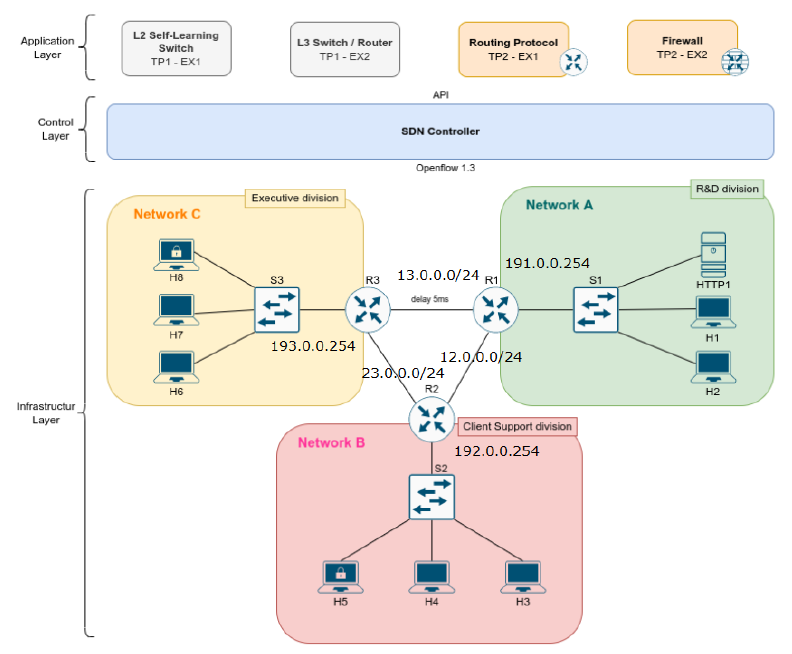

# Network Virtualization (MERSTEL)

Exercises and projects developed during the Network Virtualization curricular unit of the Engineering of Computer Networks and Telematic Services from School of Engineering, University of Minho https://www.eng.uminho.pt/en/study/_layouts/15/UMinho.PortaisUOEI.UI/Pages/CatalogoCursoDetail.aspx?itemId=3929&catId=12  
　
This project aims to implement two more applications on the application layer of the SDN architecture. The first application is the development of a routing
application. It means the application must be able to calculate the best paths among the subnets and apply them to the L3 switches. Moreover, it must be able to recognize changes in the topology the changes must be reflected in the entries in each L3 switch.
The second application is a firewall that must block traffic among networks and allow HTTP traffic in a specific port between specific hosts and the HTTP server. Both applications are going to be tested in the same network topology.

Stack:
 - Fedora 34 (kernel 5.11)
 - Mininet (version 2.3.0)
 - Ryu SDN Controller (version 4.34)
 - OpenFlow 1.3



## Running TP1 Exercise 1 (layer 2 switch)

Start topology with mininet:

```sudo mn --custom VR/topology/tp1_ex1_topology.py --topo tp1_ex1_topo --mac --controller=remote```

Start layer 2 controller:

```ryu-manager VR/switches/tp1_ex1_controller.py```

## Running TP1 Exercise 2 (layer 3 switch)

Start topology with mininet:

```sudo python3 VR/topology/tp1_ex2_topology.py```

Start layer 2 controller:

```ryu-manager VR/switches/tp1_ex1_controller.py```

Start layer 3 controller:

```ryu-manager VR/switches/tp1_ex2_controller.py --ofp-tcp-listen-port 6655```
